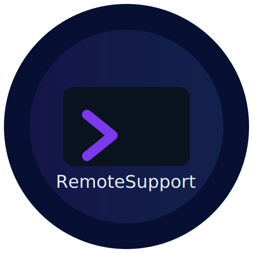

# Remote Support Assistant

[](https://opensource.org/licenses/MIT)
[](https://developer.chrome.com/docs/extensions/)
[](https://developer.mozilla.org/en-US/docs/Web/API/WebSocket)

<p align="center">
  
</p>


## Overview

**Remote Support Assistant** is a Chrome extension developed as a proof-of-concept for advanced browser-based command-and-control (C2) operations in ethical red teaming and penetration testing scenarios. Disguised as a legitimate remote support tool, it enables operators to establish persistent access, monitor user activity, extract sensitive data, and execute commands in real-time. This project simulates how malicious extensions could be used to infiltrate a victim's browser environment, capturing keystrokes, network activity, and system artifacts while evading detection.

The real intention behind this tool is to demonstrate the potential of browser extensions as a vector for red team operations, mimicking advanced persistent threat (APT) techniques like credential harvesting, behavioral profiling, and lateral movement. It was built to explore the boundaries of Chrome's APIs for C2 persistence, data exfiltration, and environmental reconnaissance, serving as a portfolio piece to showcase expertise in extension development, WebSocket protocols, and OPSEC-aware design. **Critical Disclaimer**: This is for authorized, ethical use only (with explicit consent in pentesting engagements). Misuse for unauthorized access or malicious purposes is illegal and unethical. Always obtain written permission and comply with laws like GDPR/CCPA.

The extension operates in stealth mode, blending into normal browser activity while providing a CLI server for control. It supports encrypted WebSocket communication for command issuance and data retrieval, with audit logging for post-engagement analysis. Features are modular, allowing selective deployment to minimize footprint.

**Code Availability:** The source code is not publicly shared to prevent misuse, signature-based detection, and unauthorized replication; this repository serves as a conceptual portfolio piece to demonstrate expertise in ethical red teaming, extension development, and C2 architecture for professional opportunities.

### Key Goals
- Simulate a C2 framework within browser constraints for red team training and awareness.
- Enable stealthy, consent-based (or socially engineered) access for recon and exploitation.
- Highlight OPSEC through consent masquerade, silent persistence, and filtered logging.
- Demonstrate extension security risks (permission abuse, data leak) for defensive research.

## Tech Stack

- **Frontend**: HTML/CSS/JavaScript (Chrome Extension APIs: tabs, scripting, storage, identity).
- **Communication**: WebSocket (ws library on server).
- **Backend**: Node.js server with readline for CLI interaction, fs for logging.
- **Native Host**: PowerShell (Windows) for OS integration (optional).
- **Security**: Consent prompts, audit trails, scoped permissions.

## Features

- **Real-Time Monitoring**: Capture keystrokes, form inputs, network requests, clipboard changes, and DOM mutations without disrupting the user experience.
- **Session Management**: Auto-reconnect on browser restart, persistent storage of last server URL, and multi-tab support.
- **Data Extraction**: Pull bookmarks, history, extensions, storage, screenshots, and geolocation (with consent).
- **Secure Communication**: WebSocket-based C2 channel with heartbeat for reliability; all data encrypted in transit.
- **Native Integration**: Optional native host for system-level tasks (password extraction, file open). Not Working yet can't escape chrome 
- **Audit Logging**: Comprehensive logs of all actions, saved to JSON for compliance.
- **Custom Recon Mode**: Navigate to a hosted helper page to request geolocation, camera, and mic access for advanced troubleshooting.

The tool is modular—features can be toggled via commands, making it adaptable for different support scenarios.
Features are categorized for clarity, with mechanics, red team applications, and OPSEC notes. All commands are issued via the server CLI, with responses logged to console and files for exfil.

#### Core Infrastructure
- **WebSocket C2 Channel**:
  - **Description**: Establishes a bidirectional WebSocket connection to the C2 server upon user "consent" in the popup. Heartbeats (every 60s) maintain persistence, with auto-reconnect on browser restart (using `chrome.storage.local` to cache last server URL/session ID). Supports encrypted traffic (wss://) and session IDs for multi-client tracking.
  - **Mechanics**: Background script (`background.js`) handles `WebSocket` object, with `onopen` for handshake (`hello` message with browser info, user agent, platform), `onmessage` for commands, `onclose` for cleanup. Server acknowledges with `pong`. Messages are JSON-serialized for reliability.
  - **Red Team Value**: Enables command execution ("navigate to phishing site") and data exfiltration (keystrokes as they happen). Persistence survives browser restarts—ideal for long-term access without re-infection. OPSEC: Traffic blends with normal WebSocket (chat apps); no UI alerts on reconnect.
  - **Test**: Connect via popup > `list` on server—session ID appears with IP, platform.

- **Session Persistence & Auto-Reconnect**:
  - **Description**: Stores connection details in `chrome.storage.local` (last URL, session ID). On browser startup (`chrome.runtime.onStartup`), checks if <1hr old and reconnects silently.
  - **Mechanics**: On success, `lastConnected: true`; on close, clears. Fallback to manual URL if stale. Audit logs all reconnections.
  - **Red Team Value**: Maintains foothold across reboots—evades casual detection. OPSEC: No UI prompts on reconnect; stores only essential data.
  - **Test**: Connect > close/reopen browser > popup auto-connects without input.

#### Monitoring Features (Passive Recon)
- **Keystroke Capture**:
  - **Description**: Logs every keypress in real-time, with context (target field, modifiers like Ctrl+V).
  - **Mechanics**: Content script (`content.js`) listens for `keydown`, debounces (100ms) to avoid spam, sends via port to background, then WebSocket. Filters non-char ("KEY: Ctrl pressed"). Aggregates to words for readability.
  - **Red Team Value**: Reconstructs passwords, commands, or messages typed—key for credential theft or behavioral analysis. OPSEC: No visual feedback; aggregates to words ("testing123" as one log).
  - **Test**: `watch` > type in field – "⌨ KEYSTROKE: "t" typed in INPUT#loginEmail".

- **Form Input Buffering**:
  - **Description**: Buffers typed text in inputs/textareas, sends full value on blur/change ("testing123" once, not per-char).
  - **Mechanics**: `input` event appends chars to buffer per field ID, sends on `blur`/`change`. Filters empties, debounces 200ms. Triggers screenshot on submit for credential capture.
  - **Red Team Value**: Captures full credentials/emails on form leave—perfect for login sites. OPSEC: Partial value on long inputs (first 100 chars); file save for full.
  - **Test**: `watch` > type "test@test.com" in email, tab out – "📝 FORM INPUT: "loginEmail" = "test@test.com" (blur)".

- **Clipboard Monitoring**:
  - **Description**: Captures copy/paste events, with text content (deduped if identical).
  - **Mechanics**: `copy`/`paste` listeners, debounced 200ms, sends text (truncated to 100 chars).
  - **Red Team Value**: Steals copied passwords/IDs—common user habit. OPSEC: Logs partial text if long.
  - **Test**: `watch` > Ctrl+C "secret" – "📋 CLIPBOARD copy: 'secret'".

- **DOM Text Changes**:
  - **Description**: Tracks dynamic text updates (balance changes, error messages).
  - **Mechanics**: MutationObserver on body (childList/attributes), debounced 500ms, sends changed text.
  - **Red Team Value**: Monitors sensitive updates ("OTP: 123456") or error leaks. OPSEC: Partial text (first 200 chars).
  - **Test**: `watch` > open Yahoo Finance – wait for price tick – "🔄 DOM TEXT CHANGE: 'AAPL: $150.23'".

#### Network & Navigation Features
- **Network Request Capture**:
  - **Description**: Logs API calls (fetch/XHR) and responses (method, URL, status).
  - **Mechanics**: Override `window.fetch` in content, plus background `webRequest` for full (including submits/reloads). Triggered on form submit/click.
  - **Red Team Value**: Intercepts tokens/sensitive payloads (login POST body). OPSEC: Logs URL only (body partial if large).
  - **Test**: `watch` > type "test", Enter – "🌐 NETWORK GET: https://google.com/search?q=test" + "🌐 RESPONSE: ... - Status: 200".

- **Navigation Tracking**:
  - **Description**: Logs page loads/reloads (URL, timestamp).
  - **Mechanics**: `load`/`beforeunload` in content, webRequest for 'main_frame' type.
  - **Red Team Value**: Maps user flow (login → dashboard). OPSEC: No sensitive data.
  - **Test**: `watch` > F5 – "📍 NAVIGATION: https://google.com at 11:28:30 AM".

#### Data Extraction Features
- **Bookmarks & History**:
  - **Description**: Dumps bookmarks (title, URL, path) and history (last 100 visits).
  - **Mechanics**: `chrome.bookmarks.getTree` and `chrome.history.search`, flattened for hierarchy.
  - **Red Team Value**: Reveals interests/sites for social engineering. OPSEC: Saves to JSON.
  - **Test**: `bookmarks` – "🔖 BOOKMARKS (50 URLs found): [0] Gmail: https://mail.google.com".

- **HTML/Source Dump**:
  - **Description**: Grabs full page HTML (`outerHTML`) or body content (`innerHTML`).
  - **Mechanics**: `chrome.scripting.executeScript` on tab, CSP-safe via DOM read.
  - **Red Team Value**: Full page scraping for secrets (hidden forms). OPSEC: Truncates console output, full in file.
  - **Test**: `html` – "💻 SCRIPT RESULT: <!DOCTYPE html><html>..." + HTML file saved.

- **LocalStorage/SessionStorage**:
  - **Description**: Dumps key-value pairs from tab storage.
  - **Mechanics**: Execute script to read `localStorage`/`sessionStorage` objects.
  - **Red Team Value**: Tokens/cached data (JWTs). OPSEC: JSON save.
  - **Test**: `localstorage` – "💾 STORAGE: Local (10), Session (5): [jwt]: eyJ...".

- **Screenshot**:
  - **Description**: Captures tab screenshot (visible area), optional monitor mode (interval, trigger).
  - **Mechanics**: `chrome.tabs.captureVisibleTab`, blob to server.
  - **Red Team Value**: Visual recon (screen with credentials). OPSEC: Saves as PNG.
  - **Test**: `ss` – "📸 Screenshot saved: ss-*.png".

#### User & System Recon
- **Google Account Recon**:
  - **Description**: Extracts active email/ID, name, picture; scans tabs for multi-account tokens/emails.
  - **Mechanics**: `chrome.identity.getProfileUserInfo` + tab scripting for localStorage/cookies.
  - **Red Team Value**: Account IDs for API abuse, emails for phishing. OPSEC: No prompts.
  - **Test**: `google-account` – "👤 GOOGLE ACCOUNT: hakernet92@gmail.com (ID: ...)" + extra from Gmail tabs.

- **Extensions List**:
  - **Description**: Lists installed extensions (name, ID, enabled).
  - **Mechanics**: `chrome.management.getAll`.
  - **Red Team Value**: Identify tools (password managers for crack). OPSEC: JSON save.
  - **Test**: `extensions` – "🔌 EXTENSIONS (20): uBlock Origin (ID: ..., Enabled: true)".

- **Geolocation & Media Capture**:
  - **Description**: Requests GPS (lat/lon), camera/mic access via hosted recon page.
  - **Mechanics**: Navigate to hosted recon.html, inject script to request perms, exfil data.
  - **Red Team Value**: Physical location, video/voice for OSINT. OPSEC: Looks like "helper tool".
  - **Test**: `visitrecon` > open page, click "Start Helper" – "📍 GEOLOCATION: Lat 30.0444, Lon 31.2357", "🎥 MEDIA ACCESS: Video Audio granted".

#### C2 Commands & Persistence
- **Navigate/Control**: `navigate <url>`, `reload`, `back/forward` – Remote tab control.
  - **Value**: Redirect to phishing, force loads. Test: `navigate https://example.com`.
- **Watch Mode**: Monitors keystrokes, forms, clipboard, DOM—triggers network on submit.
  - **Value**: Credential harvesting, behavior profiling. Test: `watch` > type in form.
- **Native Integration** (Optional): Passwords, system exec via PowerShell host.
  - **Value**: OS-level escalation (decrypt saved passwords). Test: `passwords` (after native setup).

#### OPSEC & Detection Evasion
- **Consent Masquerade**: Popup framed as "Support Tool"—social engineering lure.
- **Silent Persistence**: Auto-reconnect on startup, no UI alerts.
- **Data Exfil**: JSON files on server, encrypted WebSocket.
- **Cleanup**: Logs cleared on disconnect, no traces in browser.

The tool's modular design allows selective features—passive watch for intel, active recon for escalation. For portfolio, emphasize ethical boundaries (consent, audit logs) while showcasing C2 sophistication.


### Help menu

```md

╔════════════════════════════════════════════════════════════════════════════════════════════════════════════════════════════════════════════════════════════╗
║                    AVAILABLE COMMANDS                                                                                                                      ║
╠════════════════════════════════════════════════════════════════════════════════════════════════════════════════════════════════════════════════════════════╣
║ SESSION MANAGEMENT:                                                                                                                                        ║
║   list                - List all connected sessions with details (num, IP, time, platform, consent, cmds)                                                  ║
║   select <num|id>     - Select session by number or ID (autocomplete/tab toggle)                                                                           ║
║   info                - Show detailed session info (enhanced: hostname, user, domain, network interfaces)                                                  ║
║   cmd-history         - Show server command history for session                                                                                            ║
║   disconnect          - Disconnect from current session                                                                                                    ║
║                                                                                                                                                            ║
║ BROWSER CONTROL:                                                                                                                                           ║
║   tabs                - Get list of open tabs (↑/↓ to switch)                                                                                              ║
║   tab <n>             - Select tab by index                                                                                                                ║
║   navigate <url>      - Navigate to URL                                                                                                                    ║
║   back                - Go back in history                                                                                                                 ║
║   forward             - Go forward in history                                                                                                              ║
║   reload              - Reload current tab                                                                                                                 ║
║   close               - Close current tab                                                                                                                  ║
║                                                                                                                                                            ║
║ DATA EXTRACTION:                                                                                                                                           ║
║   cookies             - Get all cookies (full values, logged to cookies-log.json)                                                                          ║
║   storage             - Get localStorage/sessionStorage (full values, logged to storage-log.json)                                                          ║
║   screenshot/ss       - Take screenshot of current/specific tab                                                                                            ║
║   ss monitor <sec> <min> <trigger> - Monitor screenshot every sec for min, trigger on text in title                                                        ║
║   download/dl <url>   - Download file from URL (saves on server)                                                                                           ║
║   client-download <url> [path] - Download to client Downloads folder (saveAs dialog)                                                                       ║
║   html                - Get full page HTML (returns output)                                                                                                ║
║   source              - Get page innerHTML (returns output)                                                                                                ║
║   links               - Extract All Hyperlinks for quick recon                                                                                             ║
║   forms               - Extracts all forms/fields (names, types, values).                                                                                  ║
║   assets              - Extract Images/Scripts/Styles                                                                                                      ║
║   console             - Get Browser Console Logs/Errors                                                                                                    ║
║   bookmarks           - Get all bookmarks                                                                                                                  ║
║   browser-history     - Get browsing history                                                                                                               ║
║   extensions          - List installed extensions                                                                                                          ║
║   downloads           - Lists last 100 browser downloads                                                                                                   ║
║   watch               - Toggle watch mode (keystrokes + tab reload every 5s)                                                                               ║
║   google-account      - Get current Google account info/email                                                                                              ║
║   geolocation         - Gets current GPS (lat/long) if permitted.                                                                                          ║
║   fingerprint         - Generates unique browser fingerprint (canvas hash, fonts, screen res, userAgent).                                                  ║
║                                                                                                                                                            ║
║ CODE EXECUTION:                                                                                                                                            ║
║   exec <code>         - Execute JavaScript in current tab (CSP-safe blob injection, returns result)                                                        ║
║   eval <expr>         - Evaluate JS expression (returns result)                                                                                            ║
║   inject <file>       - Inject local JS file into tab                                                                                                      ║
║                                                                                                                                                            ║
║ SYSTEM & ADVANCED:                                                                                                                                         ║
║   ping                - Check connection latency (server<->client)                                                                                         ║
║   ping <ip>           - Client-side ping to IP (checks reachability)                                                                                       ║
║   proxy <config>      - Set browser proxy (socks5://127.0.0.1:1080)                                                                                  ║
║   sys-exec <cmd> [shell] - Execute system cmd on client (requires native host)                                                                             ║
║   client-open <path>  - Open/execute file on client with default tool (requires native host)                                                               ║
║   exec <cmd>          - Execute local system cmd on server (with output)                                                                                   ║
║   batch <cmd1; cmd2>  - Execute batch of commands sequentially                                                                                             ║
║   passwords           - Get saved browser passwords (logged to passwords-log.json, requires native host)                                                   ║
║   chrome-dir          - Get Chrome user data directory path (requires native host)                                                                         ║
║                                                                                                                                                            ║
║ UTILITY:                                                                                                                                                   ║
║   clear/cls           - Clear console                                                                                                                      ║
║   help/?              - Show this help                                                                                                                     ║
║   exit/quit           - Shutdown server                                                                                                                    ║
╚════════════════════════════════════════════════════════════════════════════════════════════════════════════════════════════════════════════════════════════╝

```

## Installation

### Prerequisites
- Google Chrome (v90+ recommended).
- Node.js (v16+ for server).
- For native host (optional): PowerShell 5+ on Windows.

### Extension Setup
1. Clone the folder from C2 server // code will not be published as it was from base meant for authorized malicious use in red team engagments 
2. Load in Chrome:
   - Go to `chrome://extensions/`.
   - Enable "Developer mode".
   - Click "Load unpacked" and select the extension directory.
3. Reload on changes (chrome://extensions > Reload button).

### Server Setup
1. Install dependencies:
   ```
   npm init -y
   npm install ws readline
   ```
2. Run the server:
   ```
   node support-server.js --port 8080
   ```
3. Connect from popup: Enter `ws://IP:8080` (or your IP: ws://10.10.2.129:8080).

## Usage

### Client (Browser Extension)
1. Click the extension icon to open the popup.
2. Enter the server URL (`ws://10.10.2.129:8080`).
3. Click "Connect to Support" – session starts.
4. Use "View Activity Log" to monitor events.

### Server (Node.js CLI)
Run the server and use commands:
- `list` – List connected sessions.
- `select <id>` – Select session.
- `tabs` – List tabs in session.
- `watch` – Start monitoring (keystrokes, forms, etc.).
- `bookmarks` – Extract bookmarks.
- `html` – Get full page HTML.
- `google-account` – Get Google profile info.
- `help` – Full command list.

Example session:
```
$ node support-server.js --port 8080
🟢 NEW CONNECTION: user-1234567890-abc (#1) from 10.10.2.1
> list
📋 ACTIVE SESSIONS (1):
  1. user-1234567890-abc (#1) [✓ SELECTED]
     IP: 10.10.2.1 | Connected: 10/21/2025, 12:43 PM | Platform: Win32 | Consent: ✅ | Commands: 0
> tabs
📑 TABS INFO: 5 tabs found
  → [0] Google - https://google.com
  [1] Gmail - https://mail.google.com
> watch
👁 Watch started (keystrokes, form inputs, network, clipboard)
> ⌨ KEYSTROKE: "t" typed in INPUT#q at 12:45 PM
> 📝 FORM INPUT: "q" = "test" at 12:45 PM
> watch stop
👁 Watch stopped
Watch session saved to watch-session-1729511100.json
```

### Screenshots

- **Popup**: Simple URL input and connect button.
  
    

- **Server CLI**: Interactive session management and logs.


